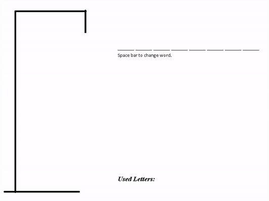

# Scientific-Hangman

A simple hangman game using the 118 elements from the [Periodic Table](https://en.wikipedia.org/wiki/Periodic_table). 

This was coded in Java with [AWT Graphics](https://docs.oracle.com/javase/7/docs/api/java/awt/Graphics.html). This game is *harder than you think* and *very* addictive.

Instructions:
* To enter a letter, just use your keyboard
* Press Space Bar to change the word at any time 
* Have fun
___

2 Classes are involved:
* *__ScientificHangman.java__*: This is the main class. Handles the drawing and input.
* *__HangmanBoard.java__*: This class contains the game properties and handles the game mechanics.

___

This is what the game looks like:

When you lose, you get a nice dying animation:

When you win, nothing special happens:

Yes. I made the GIFs in paint. That's why you see my cursor.

